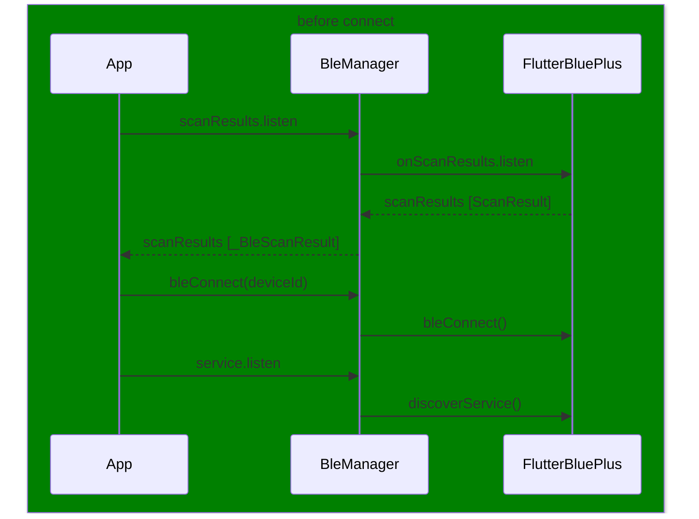
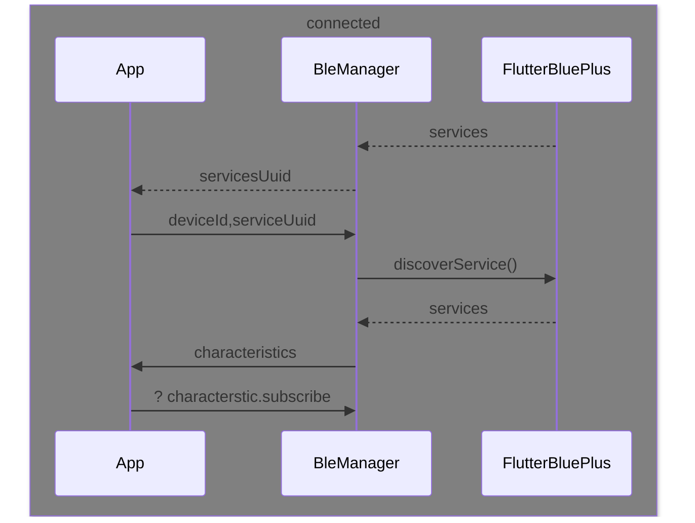

```mermaid
sequenceDiagram
    box green before connect
    participant a as App
    participant s as BleManager
    participant p as FlutterBluePlus
    end
    a ->> s : scanResults.listen
    s ->> p : onScanResults.listen
    p -->> s: scanResults [ScanResult]
    s -->> a: scanResults [_BleScanResult]

    a ->> s: bleConnect(deviceId)
    s ->> p: bleConnect()

    a ->> s : service.listen;
    s->>p:discoverService()

    
```

```mermaid
sequenceDiagram
    box grey connected
    participant a as App
    participant s as BleManager
    participant p as FlutterBluePlus
    end
    p-->>s:services
    s -->> a: servicesUuid
    a->>s:deviceId,serviceUuid
    s->>p:discoverService()
    p-->>s:services
    s->>a:characteristics
    
    a->>s:? characterstic.subscribe

```
